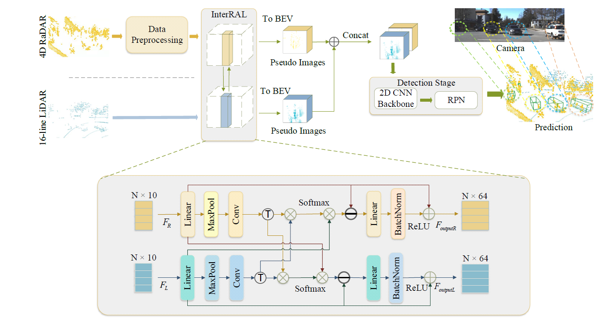

# InterFusion
This is a repo of [InterFusion](https://scholar.google.com/) for 3D object detection.

The code is mainly based on [OpenPCDet](https://github.com/open-mmlab/OpenPCDet).
<!-- 

 -->

## Introduction
Many recent works detect 3D objects by several
sensor modalities for autonomous driving, where high-resolution
cameras and high-line Lidars are mostly used but relatively
expensive. To achieve a balance between overall cost and detection
accuracy, many multi-modal fusion techniques have been suggested.
In recent years, the fusion of Lidar and Radar has gained
ever-increasing attention, especially 4D Radar, which can adapt to
bad weather conditions due to its penetrability. Although features
have been fused from multiple sensing modalities, most methods
cannot learn interactions from different modalities, which does
not make for their best use. Inspired by the self-attention mechanism,
here we present InterFusion, an interaction-based fusion
framework, to fuse 16-line Lidar with 4D Radar. It aggregates
features from two modalities and identifies cross-modal relations
between Radar and Lidar features. In experimental evaluations
on the Astyx HiRes2019 dataset, our method outperformed the
baseline by 4.09% mAP in 3D and 10.34% BEV mAP for
the car class at the moderate level. 
* Model Framework:
<p align="center">
  
</p>

## The format of the dataset
```
Astyx HiRes2019 Frameworks
├── gt_database
      ├── *.bin
├── gt_database_lidar
      ├── *.bin
├── gt_database_radar
      ├── *.bin
├── ImageSets
      ├── test.txt
      ├── train.txt
      ├── val.txt
├── testing
      ├── calibration
            ├── *.json
      ├── camera_front
            ├── *.jpg
      ├── groundtruth_obj3d
            ├── *.json
      ├── lidar_vlp16
            ├── *.txt
      ├── radar_6455
            ├── *.txt
├── training
      ├── calibration
      ...
```

## Experiment Settings:
<table align="center">
   <tr>
      <td></td>
   </tr>
   <tr>
      <td align="center">Server Model</td>
      <td></td>
      <td></td>
      <td align="center">Ubuntu 18.04</td>
      <td></td>
   </tr>
   <tr>
      <td align="center">Version of PyTorch</td>
      <td></td>
      <td></td>
      <td align="center">torch 10.1,<br>torchvision 0.11.3, <br>torchaudio 0.10.2</td>
      <td></td>
   </tr>
   <tr>
      <td align="center">Version of CUDA</td>
      <td></td>
      <td></td>
      <td align="center">CUDA 11.3</td>
      <td></td>
   </tr>
   <tr>
      <td align="center">run time</td>
      <td></td>
      <td></td>
      <td align="center">1h 20min</td>
      <td></td>
   </tr>
   <tr>
      <td align="center">number of epoch</td>
      <td></td>
      <td></td>
      <td align="center">160</td>
      <td></td>
   </tr>
   <tr>
      <td align="center">number of checkpoint</td>
      <td></td>
      <td></td>
      <td align="center">30</td>
      <td></td>
   </tr>
   <tr>
      <td align="center">number of evaluation</td>
      <td></td>
      <td></td>
      <td align="center">30</td>
      <td></td>
   </tr>
   <tr>
      <td></td>
      <td></td>
      <td></td>
      <td></td>
      <td></td>
   </tr>
</table>

## Experiment Results:
* All experiments are tested on Astyx Hires2019
<table align="center">
   <tr>
      <td></td>
   </tr>
   <tr>
      <td align="center">Modality/Method </td>
      <td align="center" colspan="3">3D mAP(%)</td>
      <td align="center" colspan="3">BEV mAP(%)</td>
      <td align="center">model</td>
   </tr>
   <tr>
      <td align="center">Radar</td>
      <td align="center">Easy </td>
      <td align="center">Moderate</td>
      <td align="center">Hard</td>
      <td align="center">Easy </td>
      <td align="center">Moderate</td>
      <td align="center">Hard</td>
      <td></td>
   </tr>
   <tr>
      <td align="center">PointRCNN </td>
      <td align="center">12.23</td>
      <td align="center">9.1</td>
      <td align="center">9.1</td>
      <td align="center">14.95</td>
      <td align="center">13.82</td>
      <td align="center">13.89</td>
      <td align="center"></td>
   </tr>
   <tr>
      <td align="center">SECOND [20] </td>
      <td align="center">24.11</td>
      <td align="center">18.5</td>
      <td align="center">17.77</td>
      <td align="center">41.25</td>
      <td align="center">30.58</td>
      <td align="center">29.33</td>
      <td align="center"></td>
   </tr>
   <tr>
      <td align="center">PVRCNN [33]</td>
      <td align="center">28.21</td>
      <td align="center">22.29</td>
      <td align="center">20.4</td>
      <td align="center">46.62</td>
      <td align="center">35.1</td>
      <td align="center">33.67</td>
      <td align="center"></td>
   </tr>
   <tr>
      <td align="center">PointPillars [30] </td>
      <td align="center">30.14</td>
      <td align="center">24.06</td>
      <td align="center">21.91</td>
      <td align="center">45.66</td>
      <td align="center">36.71</td>
      <td align="center">35.3</td>
      <td></td>
   </tr>
   <tr>
      <td align="center">Lidar</td>
      <td></td>
      <td></td>
      <td></td>
      <td></td>
      <td></td>
      <td></td>
      <td></td>
   </tr>
   <tr>
      <td align="center">PointRCNN [23] </td>
      <td align="center">30.67</td>
      <td align="center">23.69</td>
      <td align="center">23.03</td>
      <td align="center">35.75</td>
      <td align="center">28.13</td>
      <td align="center">23.79</td>
      <td></td>
   </tr>
   <tr>
      <td align="center">SECOND [20] </td>
      <td align="center">53.32</td>
      <td align="center">44.1</td>
      <td align="center">40.16</td>
      <td align="center">57.26</td>
      <td align="center">47.52</td>
      <td align="center">45.4</td>
      <td align="center"></td>
   </tr>
   <tr>
      <td align="center">PVRCNN [33] </td>
      <td align="center">54.93</td>
      <td align="center">45.29</td>
      <td align="center">41.4</td>
      <td align="center">56.71</td>
      <td align="center">47.55</td>
      <td align="center">45.06</td>
      <td></td>
   </tr>
   <tr>
      <td align="center">PointPillars [30] </td>
      <td align="center">53.02</td>
      <td align="center">43.56</td>
      <td align="center">41.72</td>
      <td align="center">55.76</td>
      <td align="center">45.81</td>
      <td align="center">43.62</td>
      <td align="center"></td>
   </tr>
   <tr>
      <td align="center">Radar+Lidar Ours(InterFusion) </td>
      <td align="center">59.04</td>
      <td align="center">47.65</td>
      <td align="center">46.47</td>
      <td align="center">68.1</td>
      <td align="center">56.15</td>
      <td align="center">55.01</td>
      <td align="center"></td>
   </tr>
   <tr>
      <td align="center">Delta </td>
      <td align="center">+6.02 </td>
      <td align="center">+4.09</td>
      <td align="center">+4.75 </td>
      <td align="center">+12.34</td>
      <td align="center"> +10.34</td>
      <td align="center"> +11.39</td>
      <td></td>
   </tr>
   <tr>
      <td></td>
      <td></td>
      <td></td>
      <td></td>
      <td></td>
      <td></td>
      <td></td>
      <td></td>
   </tr>
</table>

* The result of ablation study
<table align="center">
   <tr>
      <td></td>
   </tr>
   <tr>
      <td align="center" colspan="4">Method</td>
      <td align="center" colspan="3">3D mAP(%)</td>
      <td align="center" colspan="3">BEV mAP(%)</td>
      <td align="center">model</td>
   </tr>
   <tr>
      <td align="center">Radar</td>
      <td align="center">LiDAR</td>
      <td align="center">DP</td>
      <td align="center">InterRAL</td>
      <td align="center">Easy</td>
      <td align="center">Moderate</td>
      <td align="center">Hard</td>
      <td align="center">Easy</td>
      <td align="center">Moderate</td>
      <td align="center">Hard</td>
      <td></td>
   </tr>
   <tr>
      <td align="center">√</td>
      <td align="center"></td>
      <td align="center"></td>
      <td align="center"></td>
      <td align="center"></td>
      <td align="center"></td>
      <td align="center"></td>
      <td align="center"></td>
      <td align="center"></td>
      <td align="center"></td>
      <td></td>
   </tr>
   <tr>
      <td align="center">√</td>
      <td align="center"></td>
      <td align="center">√</td>
      <td align="center"></td>
      <td align="center"></td>
      <td align="center"></td>
      <td align="center"></td>
      <td align="center"></td>
      <td align="center"></td>
      <td align="center"></td>
      <td></td>
   </tr>
   <tr>
      <td align="center"></td>
      <td align="center">√</td>
      <td align="center"></td>
      <td align="center"></td>
      <td align="center"></td>
      <td align="center"></td>
      <td align="center"></td>
      <td align="center"></td>
      <td align="center"></td>
      <td align="center"></td>
      <td></td>
   </tr>
   <tr>
      <td align="center">√</td>
      <td align="center">√</td>
      <td align="center"></td>
      <td align="center"></td>
      <td align="center"></td>
      <td align="center"></td>
      <td align="center"></td>
      <td align="center"></td>
      <td align="center"></td>
      <td align="center"></td>
      <td></td>
   </tr>
   <tr>
      <td align="center">√</td>
      <td align="center">√</td>
      <td align="center">√</td>
      <td align="center"></td>
      <td align="center"></td>
      <td align="center"></td>
      <td align="center"></td>
      <td align="center"></td>
      <td align="center"></td>
      <td align="center"></td>
      <td></td>
   </tr>
   <tr>
      <td align="center">√</td>
      <td align="center">√</td>
      <td align="center">√</td>
      <td align="center">√</td>
      <td align="center"></td>
      <td align="center"></td>
      <td align="center"></td>
      <td align="center"></td>
      <td align="center"></td>
      <td align="center"></td>
      <td></td>
   </tr>
   <tr>
      <td></td>
      <td></td>
      <td></td>
      <td></td>
      <td></td>
      <td></td>
      <td></td>
      <td></td>
      <td></td>
      <td></td>
      <td></td>
   </tr>
</table>

## Installation
a. Clone this repository.
```shell
git clone https://github.com/adept-thu/InterFusion.git
```

b. Install the dependent libraries as follows:

* Install the dependent python libraries: 
```
pip install -r requirements.txt 
```
c. Generate dataloader
```
python -m pcdet.datasets.astyx.astyx_dataset create_astyx_infos tools/cfgs/dataset_configs/astyx_dataset.yaml
```

## Training
```
CUDA_VISIBLE_DEVICES=1 python train.py --cfg_file cfgs/astyx_models/pointpillar.yaml --tcp_port 25851 --extra_tag yourmodelname
```

## Testing
```
python test.py --cfg_file cfgs/astyx_models/pointpillar.yaml --batch_size 4 --ckpt ##astyx_models/pointpillar/debug/ckpt/checkpoint_epoch_80.pth
```

## Citation 
If you find this project useful in your research, please consider cite:


```

```

# InterFusion_output
